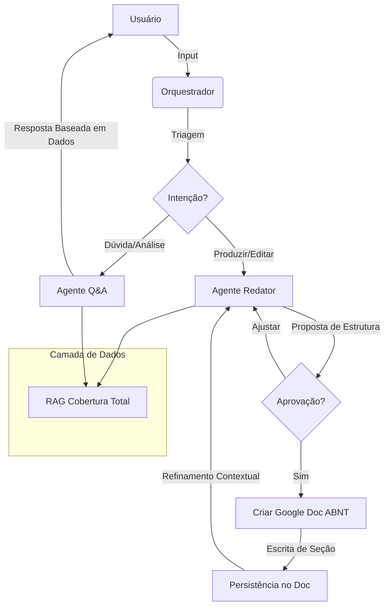

# 👨🏾‍🎓 Oráculo Acadêmico: Ecossistema Multiagentes

O **Oráculo Acadêmico** é um assistente de escrita científica de ponta que integra inteligência artificial RAG (Retrieval-Augmented Generation) com a produtividade do **Google Docs**. Projetado para mestrandos e pesquisadores, o sistema não apenas responde dúvidas, mas co-autora documentos seguindo rigorosamente as normas **ABNT**.

---

## ✨ Diferenciais Tecnológicos

- **Integração Nativa com Google Docs**: Criação automática de documentos e persistência bidirecional de seções e edições.
- **Rigor ABNT Automatizado**: Formatação nativa de margens (3cm/2cm), fontes (Times New Roman), espaçamentos (1.5) e títulos em caixa alta.
- **Sessão Aderente (Sticky Sections)**: O sistema mantém o contexto da seção em edição, permitindo ajustes sucessivos sem necessidade de repetir o capítulo.
- **Limpeza de Ruído Conversacional**: Filtro inteligente que remove saudações e comentários da IA, salvando apenas o texto acadêmico puro no documento.
- **Resiliência Industrial**: Mecanismo de *Exponential Backoff* para lidar com limites de cota da API do Google, garantindo estabilidade em fluxos intensos.
- **Triagem Multiagente**: Um orquestrador maestro que roteia pedidos entre especialistas em **Estruturação/Redação** e **Análise/QA**.

---

## 🤖 Fluxo de Inteligência e Escrita

O oráculo utiliza um fluxo de trabalho em fases para garantir que você tenha controle total sobre a estrutura antes da redação final.



---

## 🏗️ Arquitetura do Projeto

O sistema é dividido em módulos de alta coesão:

1.  **Agent Layer (`agents/`)**: Lógica de raciocínio, personas e prompts de rigor acadêmico.
2.  **Google Docs Service (`services/google_docs/`)**:
    - `DocumentManager`: Gestor de alto nível de seções e placeholders.
    - `AcademicFormatter`: O "bibliotecário" das normas ABNT.
    - `GoogleDocsClient`: Driver resiliente com rate limiting.
3.  **RAG Service (`services/`)**: Motor de busca vetorial (ChromaDB) e processamento de textos.
4.  **UI Layer (`01_home.py`)**: Interface Streamlit reativa com suporte a link direto para documentos ativos.

---

## 🚀 Como Executar

### Pré-requisitos
- Python 3.10+
- Chave de API OpenAI
- **Google Cloud Suite**: Um arquivo `credentials.json` (Service Account ou OAuth) na raiz do projeto.

### Instalação

1.  **Clone e Prepare**:
    ```bash
    git clone https://github.com/rodrigoassis1996/oraculo-academico.git
    cd oraculo-academico
    python -m venv .venv
    .\.venv\Scripts\activate  # Windows
    pip install -r requirements.txt
    ```

2.  **Configuração**:
    - Adicione sua `OPENAI_API_KEY` ao arquivo `.env`.
    - Coloque o `credentials.json` na raiz.

3.  **Inicie**:
    ```bash
    streamlit run 01_home.py
    ```

---

## 🧪 Qualidade e Validação

O sistema conta com uma suíte de **30 testes automatizados** locallizados em `tests/`, garantindo:
- Integridade de Conteúdo (ABNT).
- Estabilidade de Conexão com Google API.
- Precisão na Triagem de Agentes.

**Oráculo Acadêmico**: Transformando a carga de trabalho acadêmica em um processo de co-criação fluído e padronizado. 🎓👨🏾‍🎓✨

