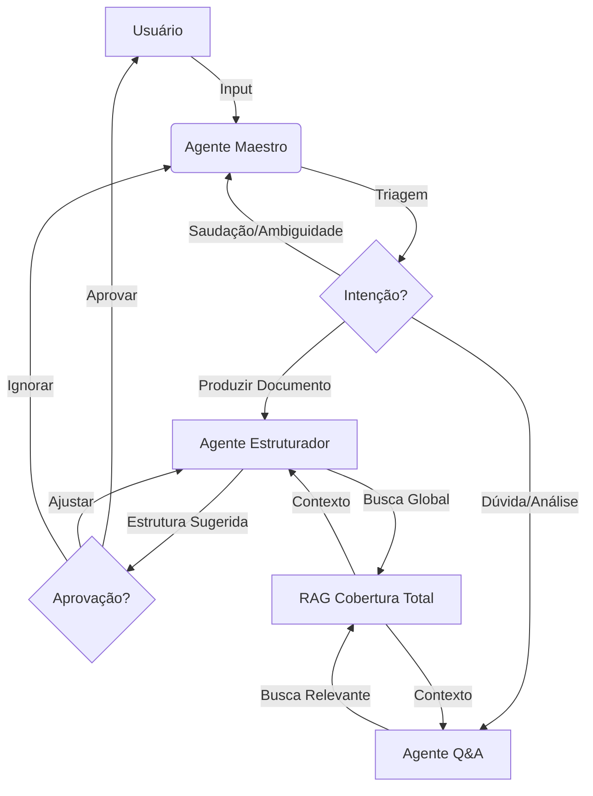

# 👨🏾‍🎓 Oráculo Acadêmico: Ecossistema Multiagentes

O **Oráculo Acadêmico** evoluiu de um simples chat RAG para um ecossistema de **Agentes Inteligentes** especializados em análise, planejamento e escrita acadêmica. Projetado para pesquisadores e estudantes, o sistema utiliza orquestração de agentes para construir documentos científicos com rigor conceitual e precisão factual.

---

## ✨ Diferenciais Tecnológicos

- **Orquestração Multiagentes**: Arquitetura baseada em papéis técnicos onde um **Agente Maestro** planeja a estrutura do documento antes da execução.
- **Experiência Zero-Click**: Detecção automática de tipo de arquivo e inicialização silenciosa do RAG ao arrastar documentos.
- **Respostas Humanizadas**: Interface focada no usuário, ocultando termos técnicos do RAG para uma comunicação natural.
- **Escrita Acadêmica Iterativa**: Loop de feedback integrado onde o usuário pode aprovar ou refinar estruturas sugeridas sucessivamente.
- **Concisão e Rigor**: Resumos de até 300 caracteres por seção para manter a objetividade.
- **Gestão de Estado Persistente**: O sistema mantém o modo de estruturação até a aprovação final, impedindo fuga de escopo.
- **RAG com Cobertura Total**: Algoritmo de recuperação per-documento que garante a análise de 100% do corpus subido.

---

## 🤖 Fluxo de Inteligência



---

## 🏗️ Arquitetura do Projeto

O sistema está organizado em camadas modulares para suporte à inteligência avançada:

1.  **Agent Layer (`agents/`)**: Lógica de raciocínio e personas especializadas.
    - `OrchestratorAgent`: O Maestro que gerencia os estados `ORCHESTRATOR`, `ESTRUTURADOR` e `QA`.
2.  **Service Layer (`services/`)**: Motores de infraestrutura.
    - `RAGManager`: Gestão de embeddings (ChromaDB) e estratégias de recuperação.
    - `TextProcessor`: Limpeza, chunking e validação de textos acadêmicos.
    - `UploadManager`: Orquestração de ingestão e extração de metadados.
3.  **Directive Layer (`directives/`)**: Módulos de SOP (Standard Operating Procedures) que guiam o comportamento dos agentes em tarefas complexas.
4.  **Skill Vault (`.agent/skills/`)**: Capacidades expandidas como *AI Engineering*, *Prompt Engineering* e *Frontend Design*.
5.  **UI Layer (`01_home.py`)**: Interface Streamlit reativa com sinalização de agentes ativos.

---

## 🚀 Como Executar

### Pré-requisitos
- Python 3.10 ou superior
- Chave de API (OpenAI ou compatível)

### Instalação e Execução

1.  **Prepare o Ambiente**:
    ```bash
    git clone https://github.com/rodrigoassis1996/oraculo-academico.git
    cd oraculo-academico
    python -m venv .venv
    # Windows
    .\.venv\Scripts\activate  
    # Linux/Mac
    source .venv/bin/activate
    
    pip install -r requirements.txt
    ```

2.  **Configure o .env**:
    Crie um arquivo `.env` na raiz com:
    ```env
    OPENAI_API_KEY=sua_chave_aqui
    ```

3.  **Inicie o Oráculo**:
    ```bash
    streamlit run 01_home.py
    ```

---

## 🧪 Qualidade e Validação

- **Testes Unitários**: Localizados em `tests/unit/`, validam desde o carregamento de modelos até a lógica de triagem do Maestro.
- **Rigor Factual**: Uso de *Chain-of-Thought* nos prompts para garantir que citações e dados venham estritamente dos documentos fornecidos.

Desenvolvido para elevar a produtividade científica com inteligência artificial de ponta. 🎓✨

