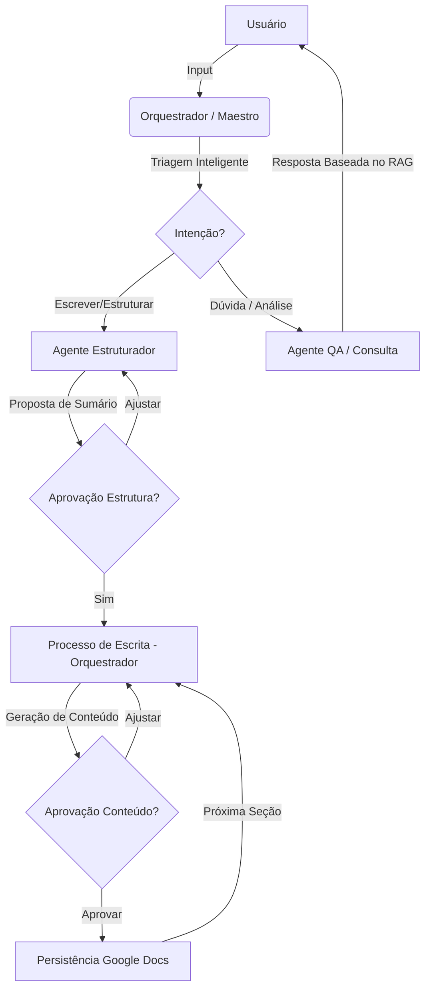

# 👨🏾‍🎓 Oráculo Acadêmico: Ecossistema de IA Full Stack

O **Oráculo Acadêmico** evoluiu de uma ferramenta experimental para um ecossistema robusto de assistência científica. Ele integra inteligência artificial de ponta (**RAG - Retrieval-Augmented Generation**) com a produtividade do **Google Docs**, garantindo que mestrandos e pesquisadores produzam textos de alta qualidade técnica seguindo rigorosamente as normas **ABNT**.

---

## ✨ Diferenciais Tecnológicos

- **Arquitetura Full Stack Moderna**: Backend resiliente em FastAPI e Frontend reativo em React 19.
- **Cérebro Multiagente (Maestro)**: Um orquestrador inteligente que tria solicitações entre especialistas em **Redação/Estruturação** e **Análise/QA**.
- **Escrita Iterativa e Inteligente**:
    - **Aprovação por Seção**: O conteúdo é gerado e revisado seção por seção, garantindo controle total do autor sobre o texto.
    - **Detecção de Estrutura**: Mapeamento automático de sumários acadêmicos a partir de diálogos naturais.
- **Integração Nativa Google Docs**:
    - **Resiliência OAuth 2.0**: Fluxo de auto-recuperação de tokens e reautenticação assistida por link direto no chat.
    - **Formatação ABNT Nativa**: Aplicação automática de margens, fontes e estilos de parágrafo sem riscos de "ranges vazios".
- **Garantia de Qualidade (QA)**: Suíte abrangente com **48+ testes automatizados** (Backend + Frontend).
- **Auto-recuperação de Dados**: Protocolos de limpeza e restauração para o banco vetorial (ChromaDB) em ambientes Windows/Linux.

---

## 🤖 Fluxo de IA e Roteamento

O Oráculo utiliza uma arquitetura de agentes onde cada um possui uma responsabilidade clara, coordenada pelo **Orquestrador Central**.



---

## 🏗️ Estrutura do Projeto e Agentes

O ecossistema é dividido em competências específicas:

### 🧠 Cérebro (Agentes)
- **Orquestrador (Maestro)**: O coração do sistema. Gerencia o estado da sessão, realiza a triagem de intenções, **coordena o loop de escrita das seções** e faz a ponte final com a API do Google Docs.
- **Agente Estruturador**: Especialista em semântica acadêmica. Responsável por analisar o tema do usuário e propor um sumário/esqueleto coerente e fundamentado.
- **Agente QA (Consulta)**: Focado em extração de informação. Utiliza RAG para responder dúvidas específicas baseadas estritamente nos documentos carregados.

### 🐍 Backend (Python 3.11 + FastAPI)
- `agents/`: Implementação da lógica dos agentes e personas.
- `services/`: 
    - `google_docs/`: Gerenciador de documentos, formatador ABNT e cliente OAuth.
    - `rag_manager.py`: Indexação e busca vetorial com ChromaDB.
- `main_api.py`: Exposição de regras de negócio via API REST.

### ⚛️ Frontend (React 19 + TypeScript)
- Localizado em `frontend/`.
- UI moderna e reativa utilizando **TailwindCSS** e **Ant Design**.
- Comunicação em tempo real para streaming de respostas.

### 🧪 QA & Testes (Pytest + Vitest)
- `tests/`: Testes unitários, de integração e E2E (Foco em Resiliência e Documentos).
- `frontend/src/__tests__/`: Testes de componentes e gestão de estado.

---

## 📋 Pré-requisitos
- Python 3.11+ e Node.js 18+
- Chave de API OpenAI (em `.env`)
- Google Cloud: Arquivo `credentials.json` na raiz do projeto.

---

## 🚀 Início Rápido

### 1. Configuração Inicial
Configure o ambiente e instale as dependências necessárias.

**Backend**:
```bash
python -m venv .venv
.\.venv\Scripts\activate
pip install -r requirements.txt
```

**Frontend**:
```bash
cd frontend
npm install
```

---

### 2. Execução (Uso Diário)

**Passo 1: Iniciar o Backend (FastAPI)**
```bash
.\.venv\Scripts\activate
python -m uvicorn main_api:app --reload
```

**Passo 2: Iniciar o Frontend (React + Vite)**
```bash
cd frontend
npm run dev
```
> Acesse: `http://localhost:5173`

---

## 🧪 Suíte de Validação

Para garantir a estabilidade do sistema:

```bash
# Rodar todos os testes de backend
pytest tests/

# Rodar testes específicos de resiliência
pytest tests/unit/test_google_oauth_resilience.py
```

**Status Atual: Todos os testes passando com foco em estabilidade operacional.**

---

**Oráculo Acadêmico**: Transformando a complexidade da pesquisa científica em um processo de co-criação fluído, estável e padronizado. 🎓👨🏾‍🎓✨
