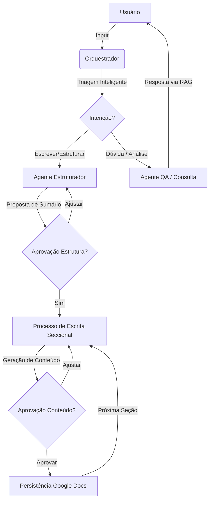

# 👨🏾‍🎓 Oráculo Acadêmico: Ecossistema de IA Full Stack

O **Oráculo Acadêmico** evoluiu de uma ferramenta experimental para um ecossistema robusto de assistência científica. Ele integra inteligência artificial de ponta (**RAG - Retrieval-Augmented Generation**) com a produtividade do **Google Docs**, garantindo que mestrandos e pesquisadores produzam textos de alta qualidade técnica seguindo rigorosamente as normas **ABNT**.

---

## ✨ Diferenciais Tecnológicos

- **Arquitetura Full Stack Moderna**: Backend resiliente em FastAPI e Frontend reativo em React 19.
- **Cérebro Multiagente (Maestro)**: Um orquestrador inteligente que tria solicitações entre especialistas em **Redação/Estruturação** e **Análise/QA**.
- **Escrita Iterativa e Inteligente**:
    - **Aprovação por Seção**: O conteúdo é gerado e revisado seção por seção, garantindo controle total do autor sobre o texto.
    - **Detecção de Estrutura**: Mapeamento automático de sumários acadêmicos a partir de diálogos naturais.
- **Integração Nativa Google Docs**:
    - **Resiliência OAuth 2.0**: Fluxo de auto-recuperação de tokens e reautenticação assistida por link direto no chat.
    - **Formatação ABNT Nativa**: Aplicação automática de margens, fontes e estilos de parágrafo sem riscos de "ranges vazios".
- **Garantia de Qualidade (QA)**: Suíte abrangente com **50+ testes automatizados**, segregando testes unitários/integração de testes End-to-End (E2E).
- **Auto-recuperação de Dados**: Protocolos de limpeza e restauração para o banco vetorial (ChromaDB) e gerenciamento resiliente de sessões.

---

## 🤖 Fluxo de IA e Roteamento

O Oráculo utiliza uma arquitetura multiagente coordenada pelo **Orquestrador Central**.


```mermaid
graph TD
    A[Usuário] -->|Input| B(Orquestrador)
    B -->|Triagem Inteligente| C{Intenção?}
    
    C -->|Escrever/Estruturar| D[Agente Estruturador]
    C -->|Dúvida / Análise| E[Agente QA / Consulta]
    
    D -->|Proposta de Sumário| F{Aprovação Estrutura?}
    F -->|Ajustar| D
    
    F -->|Sim| G[Processo de Escrita Seccional]
    G -->|Geração de Conteúdo| H{Aprovação Conteúdo?}
    
    H -->|Aprovar| I[Persistência Google Docs]
    H -->|Ajustar| G
    
    I -->|Próxima Seção| G
    
    E -->|Resposta via RAG| A
```

---

## 🏗️ Estrutura do Projeto

O ecossistema é dividido em competências específicas:

### 🧠 Cérebro (Agentes)
- **Orquestrador (Maestro)**: Gerencia o estado da sessão, triagem de intenções e coordena o loop de escrita seccional com persistência no Google Docs.
- **Agente Estruturador**: Especialista em semântica acadêmica. Analisa o tema e propõe um sumário fundamentado.
- **Agente QA (Consulta)**: Utiliza RAG para responder dúvidas baseadas nos documentos carregados no ChromaDB.

### 🐍 Backend (Python 3.11 + FastAPI)
- `agents/`: Lógica dos agentes e definições de personas.
- `services/`: 
    - `google_docs/`: Gerenciador de documentos, formatador ABNT e cliente OAuth 2.0.
    - `rag_manager.py`: Indexação e busca vetorial.
- `main_api.py`: Endpoint principal e regras de negócio.

### ⚛️ Frontend (React 19 + TypeScript)
- Localizado em `frontend/`.
- UI moderna baseada em **Ant Design** e **TailwindCSS**.
- Gerenciamento de estado otimizado para streaming de IA.

---

## 🧪 Suíte de Testes e Qualidade

O projeto utiliza uma abordagem de testes segregada para garantir rapidez no desenvolvimento e confiabilidade no deploy.

### 1. Testes de Backend (Pytest)

Os testes estão divididos em categorias para facilitar a execução:

```bash
# Executar apenas testes unitários e de integração (Rápido)
pytest -m "not e2e"

# Executar apenas testes End-to-End (Requer credenciais reais)
pytest -m e2e

# Executar testes específicos de um módulo (ex: Google Docs)
pytest tests/services/test_google_docs_resilience.py
```

### 2. Testes de Frontend (Vitest)
```bash
cd frontend
npm test
```

### 3. Cobertura e Resiliência
- **Mocking Extensivo**: Testes unitários utilizam mocks para simular APIs externas (OpenAI, Google).
- **Resiliência OAuth**: Testes específicos validam a renovação de tokens e recuperação de erros 401/403.
- **Integridade RAG**: Verificação de sanidade do ChromaDB e persistência de documentos.

---

## 🚀 Início Rápido

### 1. Configuração do Ambiente

**Backend**:
```bash
python -m venv .venv
.\.venv\Scripts\activate
pip install -r requirements.txt
```

**Frontend**:
```bash
cd frontend
npm install
```

### 2. Execução (Desenvolvimento)

**Terminal 1 (API)**:
```bash
.\.venv\Scripts\activate
python -m uvicorn main_api:app --reload
```

**Terminal 2 (Web)**:
```bash
cd frontend
npm run dev
```
> Acesse: `http://localhost:5173`

---

**Status Atual: Estável. Suíte de QA integrada e documentada.** 🚀🎓

---

**Oráculo Acadêmico**: Transformando a complexidade da pesquisa científica em um processo de co-criação fluído, estável e padronizado. 🎓👨🏾‍🎓✨
